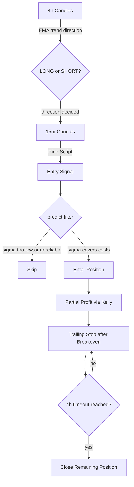
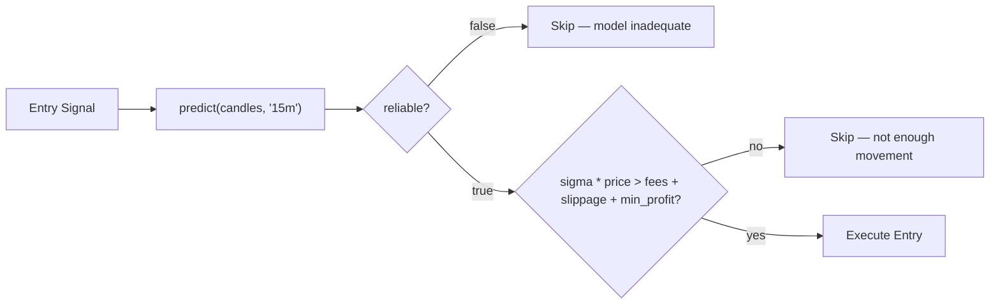
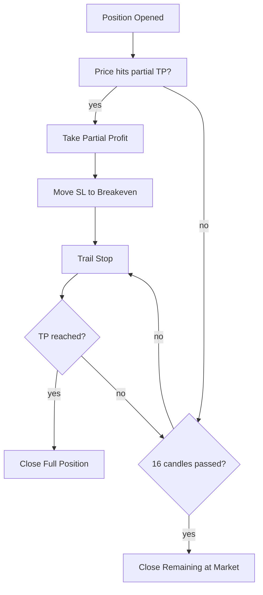

# Volatility-Filtered EMA Strategy

> Use GARCH/EGARCH volatility forecasts to filter out unprofitable EMA signals before entering a trade.

## The Problem

EMA crossovers generate too many signals. Most of them occur during low-volatility sideways markets where price doesn't move enough to cover fees and slippage. The result: death by a thousand cuts.

**The fix:** before entering any trade, ask the model — "is there enough expected movement to justify this entry?"

## Architecture



## Step 1 — Trend Direction (4h)

The higher timeframe decides one thing: do we only look for longs, or only for shorts.

- **Input:** 200+ candles on the 4h chart
- **Method:** EMA crossover (or any trend indicator — MACD, Supertrend, etc.)
- **Output:** a single bias — LONG or SHORT

No entries happen on this timeframe. It only sets the filter for step 2.

**Why 4h:** short enough to catch regime changes within days, long enough to avoid whipsaws. Daily works too but reacts slower.

## Step 2 — Entry Signal (15m)

Pine Script runs on the 15m chart and generates candidate entry points in the direction decided by step 1.

- If 4h says LONG — only bullish signals pass
- If 4h says SHORT — only bearish signals pass

This already eliminates ~50% of false signals (counter-trend entries).

**Why 15m:** gives precise entries within the 4h trend. Lower timeframes (1m, 5m) have too much microstructure noise. Higher (1h) lose precision.

## Step 3 — Volatility Filter (GARCH)

This is where the `predict` function comes in. Before executing any entry signal from step 2, we check if the expected price movement justifies the trade.



### What predict does

1. Takes 300+ candles on 15m
2. Auto-selects GARCH or EGARCH based on leverage effect
3. Returns `sigma` — expected price movement for the next candle (as a fraction)
4. Returns `reliable` — whether the model converged and passed adequacy tests

### The filter logic

```
expected_move = sigma * current_price
total_cost = slippage + exchange_fee_open + exchange_fee_close

if (!reliable) → skip
if (expected_move < total_cost + minimum_profit) → skip
else → enter
```

**`minimum_profit`** is your decision, not the model's. It represents the smallest gain worth your time and risk. Without it, you enter trades with zero expected value after costs.

### What this catches

| Scenario | sigma | Action | Why |
|----------|-------|--------|-----|
| Tight consolidation | 0.1–0.3% | Skip | Price won't move enough to cover fees |
| Normal trend | 0.5–1.5% | Enter | Enough room for TP with acceptable SL |
| High volatility | >2% | Enter with caution | Wide SL required, but TP potential is large |
| Model failure | any | Skip | `reliable = false` — data doesn't fit GARCH |

## Step 4 — Position Management

Once inside a trade, three rules govern the exit:

### Partial profit (Kelly)

Take partial profit at a Kelly-optimal fraction of the position. Kelly criterion:

```
f* = (win_rate * avg_win - (1 - win_rate) * avg_loss) / avg_win
```

**Use half-Kelly** (`f*/2`) until you have 100+ trades for stable win rate estimation. Full Kelly is mathematically optimal but practically fragile — overestimates edge when sample size is small.

Recalculate Kelly parameters every N trades as your sample grows.

### Trailing stop after breakeven

After partial profit is taken:

1. Move stop-loss to breakeven (entry price + fees)
2. Trail the stop behind price as it moves in your favor
3. Let the remaining position ride the trend

This converts a winning trade into a risk-free position. The worst outcome after partial profit is breaking even on the remainder.

### Timeout: 16 candles

If TP is not reached within 16 candles of 15m (= 4 hours), close the remaining position at market.

**Why 16 candles, not 4 hours:** aligns with your entry timeframe. If you entered on candle N, you exit on candle N+16 regardless of wall clock time. Avoids edge cases where entering at the end of a 4h window gives you only minutes.

**Why 4 hours at all:** matches the higher timeframe. If the 4h trend is valid, a 15m entry should reach TP within one 4h candle. If it doesn't — the signal was likely noise.



## What This Strategy Does NOT Do

- **Does not predict direction.** GARCH says "price can move ±1.2%", not "price will go up." Direction comes from EMA.
- **Does not replace risk management.** Position sizing, max drawdown, correlation between positions — all separate concerns.
- **Does not guarantee profits.** It filters out entries where the math doesn't work. The remaining entries still depend on your directional accuracy.

## Summary

| Step | Timeframe | Tool | Purpose |
|------|-----------|------|---------|
| 1 | 4h | EMA | Trend bias (long/short) |
| 2 | 15m | Pine Script | Entry signal |
| 3 | 15m | `predict()` | Volatility filter — is there enough movement? |
| 4 | 15m | Kelly + trailing | Position management — partial profit, trail, timeout |

The core insight: **EMA tells you where, GARCH tells you whether it's worth going there.**
